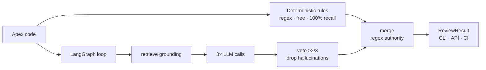

# ApexDebugger — hybrid AI code reviewer for Salesforce Apex + LWC

An agentic code reviewer that catches governor-limit risks, security gaps (CRUD/FLS,
sharing), and design smells in Apex **and** Lightning Web Components — built as a
**deterministic rules engine + LLM reasoning layer**, gated by a labeled golden eval
set with F1 scoring.

**The differentiator: it reasons _across files_.** Most Salesforce linters read one file
at a time. ApexDebugger traces user input from an LWC into the Apex controller it calls
and flags injection that lives in the **seam** between them — a bug no single-file tool
can see. (See *Cross-language reasoning* below.)

Built by a Salesforce architect (8 yrs, 13 certs incl. Sharing & Visibility Architect)
encoding real review judgment into a measurable AI system.



## Why hybrid — the core design decision

| | Deterministic rules | LLM reasoning |
|---|---|---|
| Catches | SOQL/DML in loops, hardcoded IDs, CRUD/FLS, sharing, nesting depth | complexity, duplicate methods, exception risk — what regex *can't* see |
| Reliability | 100%, every run | probabilistic (measured, see eval) |
| Cost | free, instant | metered API calls |

**Objective checks live in the certain layer; judgment calls go to the LLM.** A reviewer
that "usually" catches governor-limit bugs is worthless — the deterministic floor is what
lets this tool make a guarantee.

## Reliability engineering on the LLM layer

- **Blind independent review** — the LLM never sees the regex findings (no anchoring;
  it's a genuine second reviewer, not a rubber stamp).
- **Consensus voting** — 3 independent runs, keep findings appearing in ≥2. Random
  hallucinations flicker between runs; real findings are stable. Measured effect:
  run-to-run variance (spread) collapsed to ~0 on most golden cases.
- **Regex authority** — for rule types the deterministic layer owns, its verdict is
  final; LLM claims on those are dropped. Kills *stable* hallucinations voting can't.
- **Controlled vocabulary** — a shared `RuleId` enum forces both layers to speak the
  same language, making findings dedupable and scoreable.

## The eval is the product

Every finding type is scored against a hand-labeled golden set (`eval/golden_set.jsonl`)
— review judgment frozen into data.

- `eval/runner.py` — **deterministic gate**: regex layer vs golden labels. Free,
  reproducible, runs in CI on every PR. Currently 17/17 cases at 1.00 precision/recall.
- `eval/llm_eval.py` — **probabilistic eval**: full pipeline, N runs per case, reports
  mean F1 **and spread**. Spread doubles as a diagnostic: low spread + low score =
  deterministic bug (fix the code); high spread = LLM noise (fix the prompt).
- Grounding was **A/B tested** (with/without): general SF best practices gave zero lift
  (the model already knows them) — so grounding effort targets project/org-specific docs,
  where the model has a genuine knowledge gap.

## Cross-language reasoning — the multi-file seam

Single-file linters miss bugs that only exist *between* files. A multi-agent orchestrator
routes each file to its reviewer (Apex / LWC), then runs two cross-file passes:

- **`correlate` (deterministic)** — an LWC calling an Apex controller that lacks CRUD/FLS
  or sharing enforcement is a security risk *at the call site*. Pure set-membership over
  findings — bounded, so it's plain code.
- **`cross_reason` (LLM data-flow)** — traces untrusted LWC input into unsafe dynamic
  SOQL/DML in the Apex it calls. Whether concatenation is *actually* exploitable is a
  judgment call (a bound value is safe; query-string concatenation is not) — unbounded,
  so it's an LLM node with 3× voting. On an LWC-only PR the unchanged controller is
  regex-resolved from the repo for free, so the seam is still checked.

The layer split follows one rule: **bounded-and-decidable → code; unbounded-judgment → LLM.**

## What it costs

**~$0.0035 per pull request** (measured, not estimated). A 2-file PR runs 10 LLM
calls — Apex graph (3× vote) + LWC graph (3×) + cross-language reasoning (3×) +
one rollup summary — ≈16.8K tokens on `gpt-4o-mini` ($0.15 / $0.60 per 1M in/out).
Scales roughly linearly per changed file (~3 calls each). The deterministic regex
layer and the CI gate are free; only the LLM layer costs anything — cheap enough to
run on every push.

## What it catches

Governor limits (SOQL/DML in loops), hardcoded record & external IDs, missing CRUD/FLS
enforcement (all API v56+ syntaxes: `WITH USER_MODE`, `WITH SECURITY_ENFORCED`,
`as user/system`, `AccessLevel.*`), missing sharing declarations, explicit system-mode
bypasses, nested-loop depth (CPU/heap risk), duplicate methods, exception risk,
complexity — full taxonomy in `RuleId` (`src/apex_copilot/reasoning/models.py`).

Reviews can be grounded on **your own team's conventions**: point
`USER_BEST_PRACTICES_PATH` at a project-specific markdown doc.

## Quick start

```bash
uv sync --extra dev
export OPENAI_API_KEY=sk-...                        # .env also works

PYTHONPATH=. uv run copilot review path/to/MyClass.cls    # review a file
PYTHONPATH=. uv run python -m pytest -m "not integration" # unit tests (free)
PYTHONPATH=. uv run python eval/runner.py                 # deterministic gate (free)
PYTHONPATH=. uv run python eval/llm_eval.py               # full LLM eval (costs $)
PYTHONPATH=. uv run uvicorn app:app --reload              # POST /review API
```

## Repo map

```
src/apex_copilot/   Apex reviewer: regex rules + LangGraph reasoning + grounding
src/lwc_copilot/    LWC reviewer: regex rules + LangGraph reasoning
src/orchestrator/   route → per-file review → correlate → cross_reason → synthesize
src/review_core/    shared RuleId taxonomy, voting, merge, models (both languages)
eval/               golden set + deterministic runner + LLM eval (F1 + spread)
tests/              unit (CI) + integration (manual, marked)
cli/ · app.py       click CLI · FastAPI endpoint
docs/               learning-journal.md — the reasoning behind every design decision
.github/            CI: unit tests + deterministic eval gate + review-on-PR
```

## Roadmap

| Stage | Status |
|---|---|
| Deterministic rules engine + CLI | ✅ |
| LangGraph reasoning, structured output, taxonomy | ✅ |
| Voting, regex authority, F1 eval + variance diagnostics | ✅ |
| Best-practices grounding (A/B measured) + user-supplied docs | ✅ |
| CI gate (tests + deterministic eval) | ✅ |
| Review-on-PR GitHub Action | ✅ |
| Multi-agent orchestrator (Apex + LWC reviewers, cross-file passes) | ✅ |
| Cross-language correlator (LWC→Apex security seam, deterministic) | ✅ |
| Cross-language data-flow reasoning (LLM: unsanitized input across the seam) | ✅ |
| Cross-file synthesizer (dedup + root-cause rollup) | 🔜 |
| Org-metadata grounding (schema, FLS, sharing) — the org-aware moat | planned |
| Interprocedural analysis (method-in-loop DML), VS Code extension | planned |

## Design notes

The full reasoning — every tradeoff, why each layer exists, what the A/B tests showed —
is in [docs/learning-journal.md](docs/learning-journal.md).
